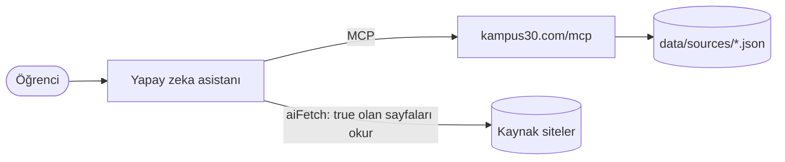

<div align="center">


# Kampüs30

**Fırsatları ve CV'ni yapay zekana sor.**

[](https://github.com/suleyman-kara/kampus30/actions/workflows/ci.yml)
[](https://github.com/suleyman-kara/kampus30/actions/workflows/sources.yml)
[](LICENSE)

[kampus30.com](https://kampus30.com)

</div>

---

Kampüs30, Claude ve Gemini gibi yapay zeka asistanlarına bağlanan ücretsiz bir **MCP sunucusu**. Türkiye'deki üniversite öğrencileri için hackathon, kamp, bootcamp, staj, yarışma ve burs fırsatlarının yayınlandığı kaynakları bilir. Asistanın bu kaynaklara gider ve bulduklarını linkleriyle getirir. CV'ni de seninle birlikte hazırlar. Üyelik yok, kişisel veri yok.

## Bağlan

MCP sunucusunun adresi:

```
https://kampus30.com/mcp
```

| Uygulama | Nasıl |
|---|---|
| Claude (web / masaüstü) | **Customize** → **Connectors** → **Add custom connector** → adı `Kampüs30`, URL yukarıdaki adres |
| Claude Code | `claude mcp add --transport http kampus30 https://kampus30.com/mcp` |
| Gemini CLI | `~/.gemini/settings.json` → `{"mcpServers": {"kampus30": {"httpUrl": "https://kampus30.com/mcp"}}}` |
| VS Code | `.vscode/mcp.json` → `{"servers": {"kampus30": {"type": "http", "url": "https://kampus30.com/mcp"}}}` |
| Cursor | `~/.cursor/mcp.json` → `{"mcpServers": {"kampus30": {"url": "https://kampus30.com/mcp"}}}` |

Hesap ya da API anahtarı gerekmez.

## Neler sorabilirsin?

- "İstanbul'da bu ay başvurusu kapanan yapay zeka hackathonları var mı?"
- "Bilgisayar mühendisliği 3. sınıfım. Yaz stajı için hangi programlara bakmalıyım?"
- "GitHub kullanıcı adım şu, LinkedIn PDF'im ekte. Bana tek sayfalık bir CV hazırla."
- "Şu staj ilanına göre CV'mi uyarla ve eksik kalan yeteneklerimi söyle."

## Araçlar

| Araç | Ne yapar |
|---|---|
| `find_sources` | İsteğe uyan kaynak sayfaları alan, tür ve şehre göre bulur. Asistan sayfaları kendisi okur |
| `list_categories` | Hangi alan, tür ve şehirlerde kaynak olduğunu gösterir |
| `get_cv_guide` | Uydurmayan, ATS uyumlu öğrenci CV'si için rehber; ilana göre uyarlamayı da kapsar |
| `get_github_projects` | Açık GitHub repolarını proje listesi olarak getirir; CV'ye girecekleri kullanıcı seçer |

Komutlar: `firsat-ara`, `cv-hazirla`.

## Nasıl çalışır?



- Sunucu fırsat verisi tutmaz; fırsatların yayınlandığı sayfaların **dizinini** tutar. Dizin [kaynaklar sayfasında](https://kampus30.com/kaynaklar) ve [JSON olarak](https://kampus30.com/kaynaklar.json) herkese açık.
- Asistan her fırsatı kaynak linkiyle verir. Sunucu, tarihi yalnızca sayfada yazıyorsa vermesini, yılı tahmin etmemesini ve bitmiş fırsatları listelememesini ister.
- Kullanım koşulları otomatik erişimi yasaklayan siteler "yalnızca link" olarak işaretlenir; asistanlar bu sayfaları okumaz.
- Kaynaklar her hafta kontrol edilir: sayfa açılıyor mu, robots.txt ne diyor.

Ayrıntılı mimari ve tasarım kararları: **[docs/MIMARI.md](docs/MIMARI.md)**

## Kaynak eklemek

En kolay yol sitedeki **[öneri formu](https://kampus30.com/oneri)**. Ya da doğrudan pull request aç: `data/sources/<id>.json` dosyası ekle. Örnek:

```json
{
  "id": "inzva-events",
  "title": "inzva etkinlikleri",
  "url": "https://inzva.com/events",
  "organizer": "inzva",
  "description": "Algoritma ve yapay zeka kampları, programlama yarışmaları ve ileri seviye bilgisayar bilimi çalışmaları.",
  "fields": ["software"],
  "types": ["camp", "competition", "workshop"],
  "scope": "national",
  "kind": "organizer",
  "lang": "tr",
  "aiFetch": true,
  "needsJs": false,
  "active": true
}
```

Alanların anlamı `lib/schema.ts` ve [docs/MIMARI.md](docs/MIMARI.md)'de. Kulüp sayfaları, şirket kariyer sayfaları ve düzenleyicilerin kendi siteleri en değerli kaynaklar.

## Yerelde çalıştırma

Gereksinim: Node.js 22+

```bash
npm install
npm run dev     # site: http://localhost:3000, MCP: http://localhost:3000/mcp
```

| Komut | Ne yapar |
|---|---|
| `npm run lint && npm run typecheck` | ESLint ve TypeScript kontrolü |
| `npm test` | Birim testleri (ağa çıkmaz) |
| `npm run validate` | `data/sources` altındaki kaynakları şemaya göre doğrular |
| `npm run build` | Üretim build'i |
| `npm run check-sources` | Kaynakların HTTP durumunu ve robots.txt kurallarını kontrol eder |

Ortam değişkenleri `.env.example` dosyasında açıklanmıştır. Sıfırdan kurulum: **[docs/KURULUM.md](docs/KURULUM.md)**

## Proje yapısı

```
app/            sayfalar, /mcp (MCP sunucusu), /api/oneri, /kaynaklar.json
components/     arayüz bileşenleri
lib/
  mcp/          MCP sunucusu, CV rehberi, GitHub araçları
  schema.ts     kaynak şemasının tek kaynağı
  sources.ts    kaynak okuma · filter.ts: süzme · robots.ts: robots.txt
scripts/        validate, check-sources
data/sources/   kaynak dizini
tests/          testler
```

## Katkı

- Kod katkıları için önce [AGENTS.md](AGENTS.md)'deki kurallara göz atın.
- Her PR CI'da `lint`, `typecheck`, `test`, `validate` ve `build` adımlarından geçer.

## Lisans

[Apache License 2.0](LICENSE). Kodu ticari projeler dahil özgürce kullanabilir, değiştirebilir ve dağıtabilirsin; dağıtırken lisans metnini ve [NOTICE](NOTICE) dosyasını ekle. "Kampüs30" adı ve logosu lisansa dahil değildir.

Ekim 2026'dan önceki sürümler PolyForm Noncommercial 1.0.0 lisansıyla yayınlanmıştı; o sürümlerin kopyaları kendi lisansına tabidir.
