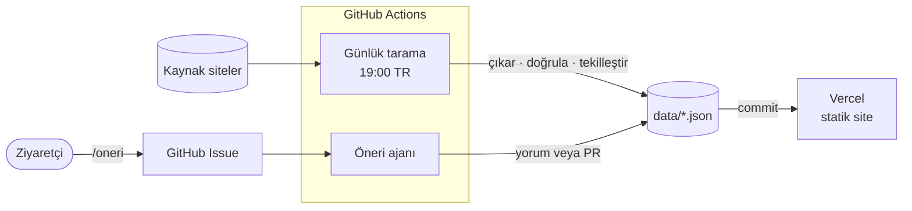

<div align="center">


# Kampüs30

**Önümüzdeki 30 gün içinde başvurabileceğin hackathon, kamp, bootcamp, staj ve yarışmalar. Tek sayfada.**

[](https://github.com/suleyman-kara/kampus30/actions/workflows/ci.yml)
[](https://github.com/suleyman-kara/kampus30/actions/workflows/scan.yml)
[](LICENSE)

[kampus30.vercel.app](https://kampus30.vercel.app)

</div>

---

Kampüs30, Türkiye'deki üniversite öğrencilerine yönelik fırsatları dağınık sitelerden toplayıp tek bir yerde sunar. Üyelik, giriş ya da uygulama gerektirmez. Etkinlikler her gün yapay zeka ile taranır. Her kayıt kaynak sayfadaki birebir alıntılarla doğrulanır, böylece uydurma bir tarih ya da etkinlik siteye giremez.

## Özellikler

- **30 günlük pencere:** Ana sayfada yalnızca başvurusu ya da başlangıcı önümüzdeki 30 güne denk gelen etkinlikler var. Şu an süren etkinlikler [Devam eden](https://kampus30.vercel.app/devam-eden) sayfasında.
- **Günlük otomatik tarama:** Kaynak siteler her akşam taranır. Değişen sayfalardan Gemini etkinlikleri çıkarır, gerekirse etkinliğin kendi sayfasına da bakar.
- **Halüsinasyon koruması:**
  - Başlık, tarih ve yıl kaynak sayfada birebir geçmiyorsa etkinlik alınmaz.
  - Yıl asla tahmin edilmez.
  - Bitmiş etkinlikler alınmaz.
- **Takvim:**
  - Her etkinlik tek tıkla Google Takvim'e eklenir.
  - Bütün etkinliklere ICS akışıyla abone olunabilir.
  - Takvime yalnızca son başvuru ve başlangıç günleri düşer.
- **Topluluk katkısı:** Ziyaretçiler eksik ya da hatalı etkinliği kişisel bilgi vermeden bildirir. Bir yapay zeka ajanı her bildirimi araştırır, teşhisini yazar ve gerekiyorsa düzeltmeyi PR olarak açar.
- **Şeffaflık:** Hangi kaynakların tarandığı ve son durumları [Kaynaklar](https://kampus30.vercel.app/kaynaklar) sayfasında. Verinin tüm geçmişi git'te.
- **Gizlilik:** Çerez yok, hesap yok, kişisel veri toplanmaz. Analitik için çerezsiz Umami kullanılır.

## Nasıl çalışır?



Veritabanı yoktur. Her etkinlik ve kaynak `data/` altında ayrı bir JSON dosyasıdır. Tarama bu dosyaları günceller ve commit'ler, Vercel de siteyi yeniden derler. Ajanın önerdiği her değişiklik bir PR'dır ve birleştirilmeden önce gözden geçirilir.

Ayrıntılı mimari ve tasarım kararları: **[docs/MIMARI.md](docs/MIMARI.md)**

## Teknolojiler

| | |
|---|---|
| Site | Next.js 16 (App Router), React 19, Tailwind CSS 4, TypeScript |
| Veri ve şema | Repo içinde JSON, zod |
| Yapay zeka | Google Gemini (`@google/genai`): yapılandırılmış çıktı, function calling, arama |
| Otomasyon | GitHub Actions: günlük tarama, sağlık kontrolü, öneri ajanı, CI |
| Barındırma | Vercel |
| Diğer | Cloudflare Turnstile, Umami, cheerio, vitest |

## Yerelde çalıştırma

Gereksinim: Node.js 22+

```bash
npm install
DATA_ROOT=tests/fixtures/sample-data npm run dev   # örnek veriyle
npm run dev                                       # canlı data/ ile
```

| Komut | Ne yapar |
|---|---|
| `npm run lint && npm run typecheck` | ESLint ve TypeScript kontrolü |
| `npm test` | Birim testleri (ağa çıkmaz, Gemini sahte istemciyle) |
| `npm run validate` | `data/` altındaki tüm dosyaları şemaya göre doğrular |
| `npm run build` | Statik üretim |
| `npm run scan -- --dry-run` | Taramayı dosya yazmadan çalıştırır (`GEMINI_API_KEY` gerekir) |
| `npm run scan -- --source <id> --force` | Tek kaynağı, sayfa değişmemiş olsa da tarar |
| `npm run agent -- --issue <n>` | Ajanı bir issue üzerinde çalıştırır |
| `npm run prune -- --dry-run` | Geçersiz eski kayıtları listeler (bayraksız çalıştırınca siler) |

Ortam değişkenleri `.env.example` dosyasında açıklanmıştır. Sıfırdan kurulum için adım adım rehber: **[docs/KURULUM.md](docs/KURULUM.md)**

## Proje yapısı

```
app/            sayfalar, OG görselleri, takvim akışı, /api/oneri
components/     arayüz bileşenleri
lib/
  scanner/      çekme, çıkarım, doğrulama, detay sayfaları, tekilleştirme, güvenlik eşikleri
  agent/        öneri ajanının döngüsü, araçları ve prompt'u
  schema.ts     tüm veri biçimlerinin tek kaynağı
scripts/        scan, agent, validate, healthcheck, prune, setup-labels
data/
  sources/      taranan kaynaklar
  events/       etkinlikler
  state/        tarama durumu
tests/          testler ve örnek veri
.github/        workflow'lar
```

## İşletme

| İş | Nasıl |
|---|---|
| Kaynak eklemek | `data/sources/<id>.json` ekleyin ya da ajanın açtığı PR'ı birleştirin |
| Etkinliği düzeltmek | `data/events/<id>.json` dosyasını düzenleyin |
| Etkinliği kalıcı olarak engellemek | Dosyayı silip `dedupeKey`'ini `data/blocklist.json`'a ekleyin |
| Sponsorlu etkinlik | Etkinliğe `"sponsored": { "until": "YYYY-MM-DD" }` ekleyin. Süre dolunca kendiliğinden düşer; "Sponsorlu" etiketi her zaman görünür |
| Taramayı elle başlatmak | Actions → **Günlük tarama** → Run workflow |
| Bir öneriyi yeniden incelemek | Actions → **Öneri ajanı** → Run workflow |
| Takip edilecek etiketler | `ajan` (ajanın PR'ları), `insan-gerekli` (ajanın emin olamadıkları), `tarama-hatasi` (tarama ya da sağlık kontrolü sorunları) |

Bir taramada daha önce çalışmış kaynakların yarısından fazlası hata verirse ya da 40'tan fazla yeni etkinlik çıkarsa hiçbir şey yazılmaz ve bir `tarama-hatasi` issue'su açılır. Ajan yalnızca `data/` altına yazabilir; kodu, workflow'ları ve sponsorlu kayıtları değiştiremez.

## Katkı

- Eksik ya da hatalı bir etkinlik gördüyseniz en hızlı yol sitedeki **[öneri formu](https://kampus30.vercel.app/oneri)**.
- Kod katkıları için önce [AGENTS.md](AGENTS.md)'deki kurallara göz atın.
- Her PR CI'da `lint`, `typecheck`, `test`, `validate` ve `build` adımlarından geçer.

## Lisans

Kaynak kodu herkese açıktır ama **ticari kullanıma kapalıdır**: [PolyForm Noncommercial 1.0.0](LICENSE).

- ✅ **Serbest:**
  - Okumak ve öğrenmek için incelemek.
  - Kişisel ya da kâr amacı gütmeyen projelerde (okul, öğrenci topluluğu, hobi) kullanmak ve değiştirmek.
  - Dağıtmak. Dağıtırken lisans metni ve `Required Notice` satırı eklenmelidir.
- ❌ **Yasak:** Kodu ya da türevini para kazanmak için kullanmak. Örneğin ücretli ya da reklamlı bir site veya hizmet işletmek, sponsorlu içerik satmak ya da bir şirketin ticari ürününe katmak.
- 💼 **Ticari kullanım:** İzin için iletişime geçin.
- **Ad ve logo:** "Kampüs30" adı ve logosu lisansa dahil değildir.

Lisans değişikliğinden önceki sürümler Apache 2.0 ile yayımlanmıştı; o sürümler için o lisans geçerliliğini korur.
